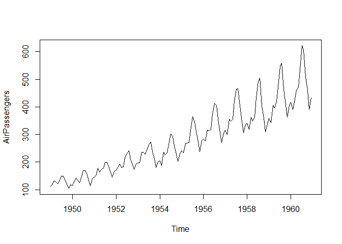

sfourspec R Package
===================

*Simple Fourier Spectra*.

Utilities to make simple spectrum analysis. Simple tools for simple
spectral analysis based on Fourier signal decomposition.

Install
-------

    remotes::install_github("https://github.com/miguel-conde/sfourspec.git",ref = "develop")

Example
-------

    library(sfourspec)

    air_pass <- tibble(t = 1:length(AirPassengers), pass = as.numeric(AirPassengers))

    plot(AirPassengers)

    lm_air_pass <- lm(pass ~ t, air_pass)

    detrended_air_pass <- AirPassengers - fitted(lm_air_pass)

    plot(detrended_air_pass)

    N <- length(detrended_air_pass)
    ns <- 0:(N-1)

    spec_x <- spectral_analysis(detrended_air_pass)

    spec_x$four_exp

    ## # A tibble: 144 x 9
    ##        n     k    w_k     f_k   T_k x_k     a_k     F_L_spectrum_k periodogram_k
    ##    <int> <dbl>  <dbl>   <dbl> <dbl> <cpl>   <cpl>            <dbl>         <dbl>
    ##  1     0     0 0      0       Inf   -1.563~ -1.085~       1.18e-30          682.
    ##  2     1     1 0.0436 0.00694 144    1.046~  7.266~       5.37e+ 1         3229.
    ##  3     2     2 0.0873 0.0139   72    1.432~  9.944~       4.86e+ 0          931.
    ##  4     3     3 0.131  0.0208   48    7.089~  4.922~       2.88e+ 1         2208.
    ##  5     4     4 0.175  0.0278   36    5.424~  3.766~       1.04e+ 0          732.
    ##  6     5     5 0.218  0.0347   28.8 -2.210~ -1.535~       3.35e+ 0          978.
    ##  7     6     6 0.262  0.0417   24    9.742~  6.765~       1.72e+ 0         1040.
    ##  8     7     7 0.305  0.0486   20.6  5.649~  3.923~       1.62e- 1         1463.
    ##  9     8     8 0.349  0.0556   18    5.627~  3.908~       4.33e+ 0         2177.
    ## 10     9     9 0.393  0.0625   16   -4.886~ -3.393~       8.91e- 1         2759.
    ## # ... with 134 more rows

    plot(spec_x)

    plot(spec_x, x_axis = "n")

    plot(spec_x, y_axis = "periodogram")

    plot(spec_x, x_axis = "T", y_axis = "periodogram", log = "xy")

    rebuilt_x <- rebuild_signal(spec_x, threshold = 1)

    plot(detrended_air_pass)
    lines(rebuilt_x, col = "red")

    rebuilt_x <- rebuild_signal(spec_x, threshold = 0.65)

    plot(detrended_air_pass)
    lines(rebuilt_x, col = "red")

